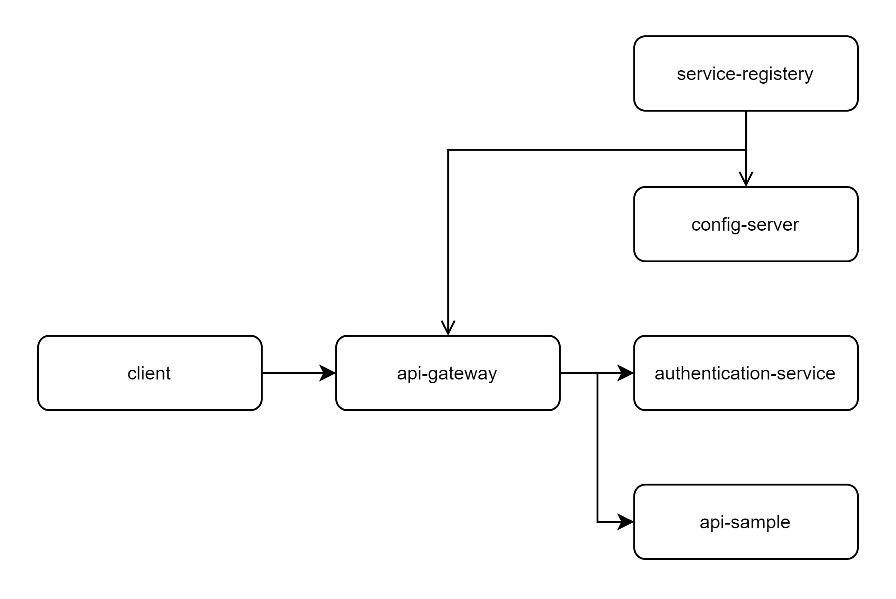
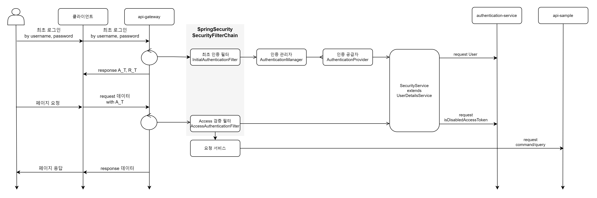

> [시작하기](./Docs/doc_Start_Guide.md)

> [0. IDE 세팅](./Docs/doc_Set_VSCode.md)

> [1. 기본 정보](./Docs/doc_Basic_Information.md)

> [2. 폴더 및 파일 구조]()

> [3. 변수 및 함수 명명 규칙]()

> [4. service-registery 가이드](./Docs/doc_Service_Registery_Guide.md)

> [5. config-server 가이드](./Docs/doc_Config_Server_Guide.md)

> [6. api-gateway 가이드](./Docs/doc_Api_Gateway_Guide.md)

> [7. authorization-server 가이드](./Docs/doc_Authorization_Server_Guide.md)

> [8. api-sample 가이드](./Docs/doc_Api_Sample_Guide.md)

- 전체 구조도

- Access 과정

